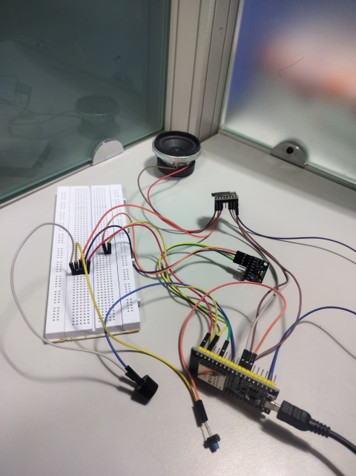
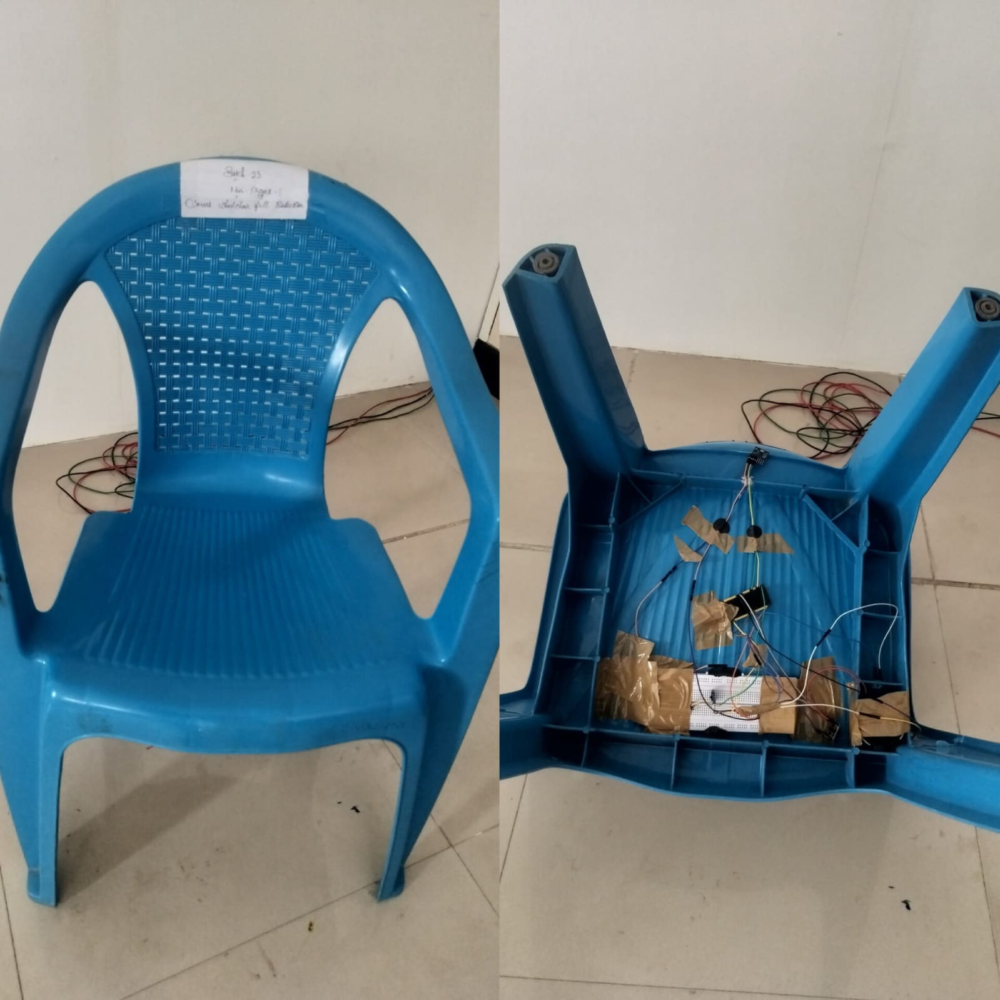

# 🚀 IoT Smart Wheelchair Fall Detection System

## 📌 Overview

This project is designed to improve the safety of elderly and physically challenged individuals by detecting falls in real-time using IoT technology. It integrates motion sensing, alert mechanisms, and cloud communication to ensure immediate assistance.

---

## 🎯 Objective

To detect sudden falls using motion sensors and automatically send emergency alerts through the internet when the user is unable to respond.

---

## ⚙️ Components Used

* ESP32 (Wi-Fi enabled microcontroller)
* MPU6050 (Accelerometer + Gyroscope)
* DFPlayer Mini (Voice Module)
* Buzzer
* Push Button (Snooze)
* Wi-Fi (for IoT communication)

---

## 🔧 Working

* MPU6050 continuously monitors acceleration and orientation
* Total acceleration is calculated using sensor data
* If sudden jerk (>2g) is detected → fall is suspected
* Buzzer alert is triggered immediately
* User gets 20 seconds to cancel using snooze button
* If not cancelled → emergency alert sent via Blynk
* Voice alert is played using DFPlayer module

---

## 🧠 Code Logic (Simplified)

1. Read accelerometer values (X, Y, Z)
2. Convert values into g-force
3. Calculate total acceleration
4. If threshold exceeded → trigger alert
5. Wait for user response
6. If no response → activate emergency mode
7. Send alert + play voice message

---

## 🌐 Features

* Real-time fall detection
* Emergency alert system
* False alarm prevention (snooze feature)
* Voice-based emergency response
* Live monitoring using Blynk IoT platform

---

## 🔄 System Workflow

1. System initializes sensors
2. Continuously reads motion data
3. Detects abnormal movement
4. Activates alert system
5. Waits for user confirmation
6. Sends emergency alert if needed
7. Plays voice alert

---

## 📷 Project Prototype

### 🔹 Hardware Setup

### 🔹 Working Prototype

### 🔹 Blynk Dashboard

---

## 📂 Project Structure

* code/ → Arduino program
* hardware/ → circuit diagrams
* docs/ → report & PPT
* images/ → project photos

---

## 🚀 Future Scope

* Mobile application integration
* GPS-based location tracking
* AI-based fall prediction
* Cloud data storage and analytics

---

## ⚠️ Note

Sensitive data like Wi-Fi credentials and Blynk tokens have been removed for security purposes.

---

## 👨‍💻 Author

* Surya Prasath J A
